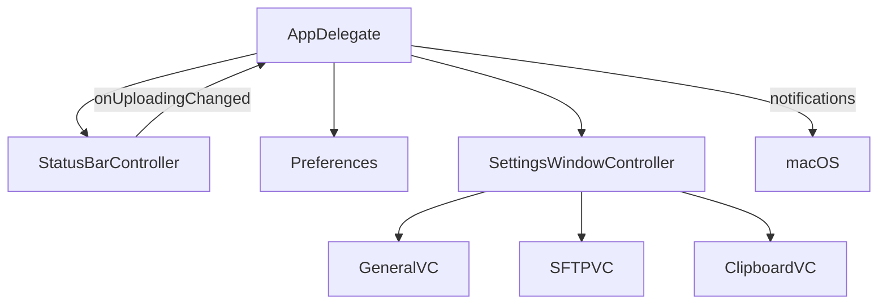

# System Patterns

## Architecture (Draft)

## Key Technical Decisions
- Segmented control in content view (not toolbar) for stable layout
- Fixed content width; dynamic height anchored to top‑left
- String Catalog for UI text

## Component Responsibilities
- AppDelegate: app lifecycle, dock animation, notifications, open Settings
- StatusBarController: status item + menu, status animation
- SettingsWindowController: section switching, window sizing/positioning
- View Controllers: pure UI + Preferences bindings
- Preferences: UserDefaults wrapper with notifications for key changes

## Critical Paths
- Upload animation path (status bar + dock)
- Settings changes → Preferences → UI reactions
 - Monosnap control path: Preferences.copyBeforeUpload → SystemIntegration.sendCmdC; Preferences.closeMonosnapAfterUpload + monosnapCloseDelayMs → delayed SystemIntegration.sendCmdW

## Error Handling
- Prefer non‑fatal UI fallbacks (e.g., text in status button if icon missing)

## Security & Privacy (Initial)
- Plan: store SFTP password in Keychain (placeholder uses UserDefaults)
- Drag & Drop Integration
  - Status item: overlay NSView (NSDraggingDestination) attached to NSStatusBarButton to avoid swizzling/overrides
  - Dock: CFBundleDocumentTypes (public.data, Viewer, LSHandlerRank=Owner for dev) + Apple Events handler for 'odoc' (kAEOpenDocuments) and NSApp.reply(toOpenOrPrint:)

- Notifications & History
  - Batch uploads produce a single summary notification (success count, error count, last item)
  - History stored as JSON in UserDefaults; history submenu with thumbnails and hover preview (NSPopover)
  - Thumbnails fetched asynchronously via URLSession; cache in-memory; preview prefers left edge and flips if insufficient space

- Info.plist & Assets
  - Explicit Info.plist checked into repo; CFBundleIconName/CFBundleIcons handled by asset catalog; AppIcon must include full mac idiom set
  - Asset catalog lives at SFTPush2/Sources/Assets.xcassets; avoid dangling references to deleted paths

- Post-upload actions
  - Preferences control copy/open behavior; cmd-click on history item forces open regardless of setting
  - Monosnap close uses a configurable delay (ms) stored in Preferences
